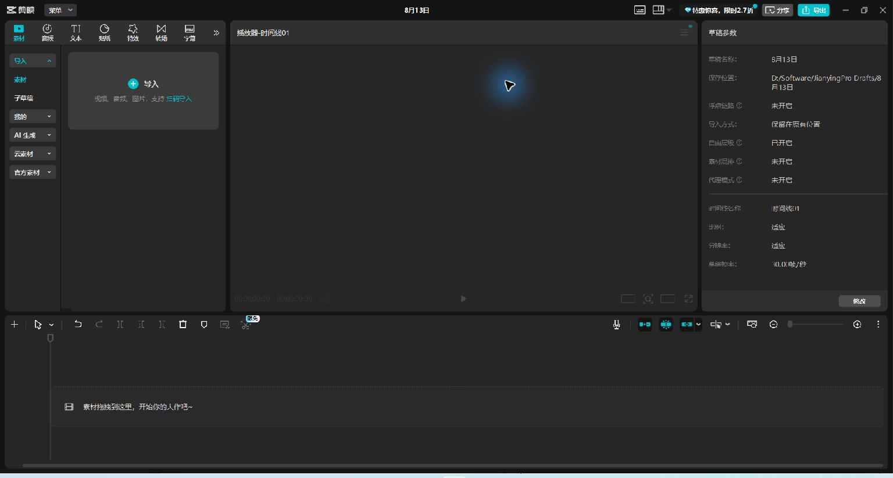
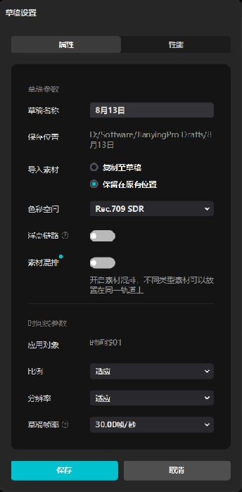
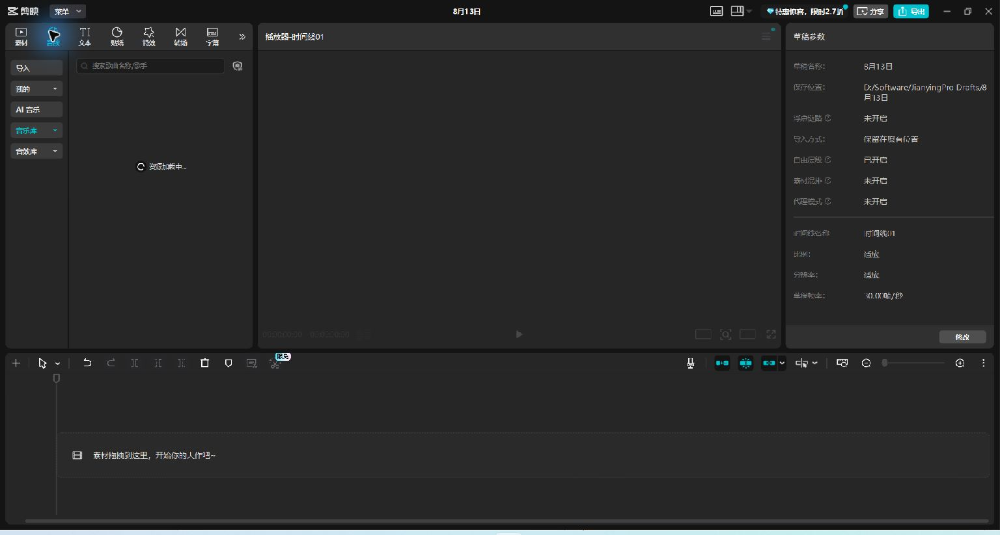
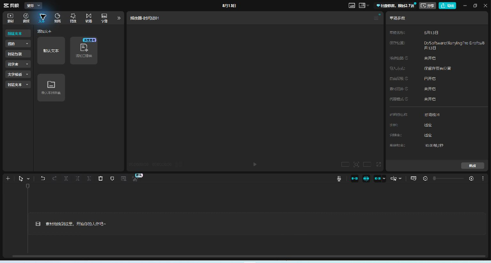

# 剪映专业版导入说明（中文参考版）

本页说明 `nle-package-v2` 在剪映专业版中的标准手动导入方法。每个实际交接包还会在
`08-timeline/import-order.md` 生成一份带有该项目画布、帧率和包级别的完整中文指南，
并把本页所用截图复制到 `08-timeline/screenshots/`。

截图来自 Windows 剪映专业版 `11.1.0.14287` 的空白工程，不包含用户视频、人脸、
产品或私有素材。后续版本的菜单位置可能变化，以文字所述功能和包内时间线为准。

## 1. 创建空白工程并设置参数

创建空白草稿后，先按包内 `08-timeline/layer-timeline.json` 设置画布和帧率。

播放器右下方可进入草稿设置，配置比例、分辨率和帧率。

## 2. 导入主画面、参考成片和音频

通过 **素材 → 导入** 加入本地文件：

1. `01-base/clean-a-roll.*` 放到主视频轨并对齐 0 秒。
2. `00-reference/automatic-master.*` 放到最上方参考轨，从 0 秒开始，默认关闭、静音并锁定。
3. 对白、BGM 和整段分组音轨通常从 0 秒开始。
4. `05-audio/sfx-events/*` 必须按 `layer-timeline.json` 的事件入点逐个放置，不能全部堆在 0 秒。

顶部“音频”页主要用于素材库和音频处理；本地音频仍可从“素材 → 导入”进入。

## 3. 导入和复刻字幕

进入 **文本 → 新建文本 → 导入本地字幕**，选择 `02-captions/master.srt`。

SRT 只携带文字和时间，不携带完整的逐词品牌色、加粗、放大和动画。需要保持剪映内可编辑时：

- 用 `master-reference.ass` 对照最终视觉；
- 用 `caption-emphasis-plan.json` 查重点词、颜色、字号倍率和时间；
- 在剪映中把重点词拆成独立文本片段或复制字幕层，手动复刻局部样式；
- 只优化语义分句和屏幕呈现，不擅自改写口播原文。

## 4. 导入动效、IP 插画和片尾

- 整段动效从 0 秒放置；事件动效按时间线 JSON 的 `timeline_start` 放置。
- IP 插画和片尾分层素材只有在清单标记为 `available` 时才导入。
- 剪映可方便地移动、裁切、隐藏和重排已渲染层；若要修改动效内部节点、连线、文案结构或关键帧逻辑，应回到 `09-source-project/` 中保留的 HyperFrames 工程。
- 片尾的背景、图标和文字说明分轨放置，便于单独改文案、缩短时长或删除。

## 5. 完成人工兼容性验证

导入后依次验证：字幕可编辑、动效可移动、事件音效可单独静音、IP 素材可移动、片尾文案可修改。
验证前 `compatibility-report.json` 必须保持 `pending`。本交接包不包含剪映原生草稿，也不声称存在剪映 API、CLI 或无人值守渲染能力。
