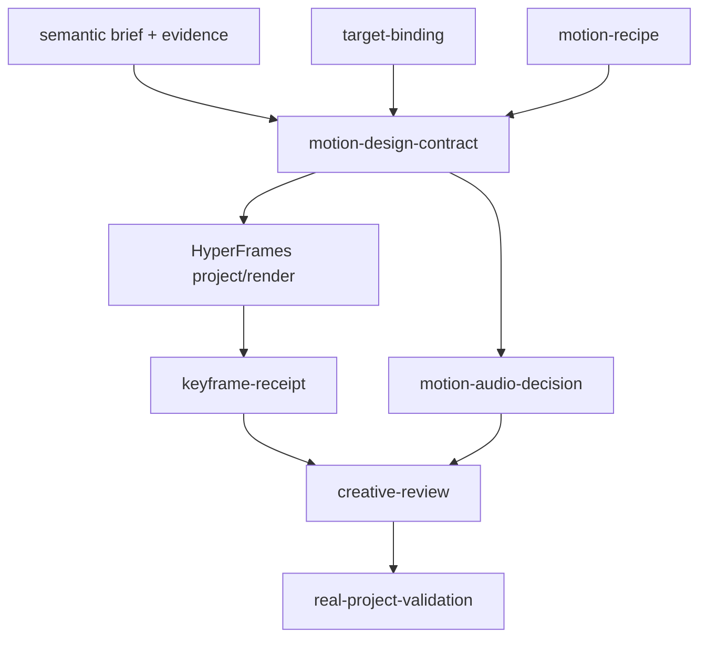

# P0-P2 Machine Contracts

Status: design-freeze candidate; schemas are drafts and are not runtime code.
Trace: RQ-002–RQ-008, RQ-012–RQ-020.

## Contract rules shared by all artifacts

1. JSON uses UTF-8 and JSON Schema Draft 2020-12.
2. Every contract has an explicit `schema_version`, stable ID, creation time,
   producer, and input hashes.
3. Paths to real artifacts are absolute Windows paths at runtime and always
   accompanied by SHA-256. When a contract declares an artifact slot but the
   asset cannot exist, it uses an explicit unavailable/action-required record in
   that contract rather than a fabricated path. A truly non-applicable optional
   field may be omitted only when its parent applicability decision is explicit.
4. A downstream artifact is stale when any declared input hash changes.
5. Enumerations are closed. Key object layers use `additionalProperties:false`.
6. Machine validation proves structure and measurable facts only. Human or
   multimodal decisions remain explicit fields and cannot be inferred from a
   schema pass.
7. Implementation must publish schemas through an additive project schema v10
   migration. Draft schemas in this directory do not alter current projects.

## Contract graph



## 1. `motion-design-contract`

Schema: `schemas/motion-design-contract.schema.json`

### Purpose

This is the compiler output and authoritative bridge from semantic planning to
rendering. It records every semantic opportunity and its editorial decision,
but only `render` decisions reference recipes and target bindings.

### Invariants

- `source_media_sha256`, `semantic_brief_sha256`, and
  `production_contract_sha256` are mandatory.
- Every opportunity has one decision and rationale.
- A `render` decision has a recipe ID, semantic role, audio decision ID, and all
  recipe-required target bindings.
- `caption_only`, `reuse_source`, and `quiet_source` cannot carry a recipe.
- All visible strings are contained in `approved_visible_copy` and must equal
  the later renderer-exported visible-text manifest.
- `identity_mode=third_party` forbids personal IP recipes and HongRun assets.
- `selected_event_ids` equals exactly the IDs of render decisions.

### Positive example

An opportunity for “compare CTR and CPC” is `render`, cites word IDs and frame
evidence, maps to MQE-04, uses two target binding IDs, and contains only the
approved labels “CTR” and “CPC”.

### Negative example

The compiler adds `headline: "打开"` outside the visible-copy manifest. Schema
or semantic binding rejects the artifact before rendering.

### Boundary example

A chapter has no useful visual opportunity. It contains one `quiet_source`
decision with evidence and no recipe. This is complete coverage, not a missing
event.

## 2. `motion-recipe`

Schema: `schemas/motion-recipe.schema.json`

### Purpose

A recipe is a versioned mechanism. It describes semantic roles, preconditions,
contraindications, orientation variants, visible poses, runtime requirements,
audio profile, proof requirements, cost tier, and fallback. It contains no
project-specific meaning.

### Invariants

- Four phases—entrance, explain, hold, exit—are present in chronological order.
- A phase contains at least one measurable pose property or a declared no-op.
- Advanced runtimes declare a deterministic fallback and cost tier.
- Preconditions and contraindications are executable identifiers, not prose
  alone.
- The recipe cannot choose visible text or source targets.

### Positive example

MQE-09 requires one source crop binding, declares a lens mask, scale range,
leader line, safe placement strategy, four proof phases, and a focus-box fallback.

### Negative example

`recipe_id=random-card`, `entrance=nice`, and `use_when=often` fail because no
semantic role, visible poses, executable preconditions, or proof exists.

### Boundary example

MQE-16 may be structurally valid while feature-disabled. The compiler selects
its 2.5D fallback rather than reporting the advanced runtime as available.

## 3. `target-binding`

Schema: `schemas/target-binding.schema.json`

### Purpose

This contract links a semantic event to real source geometry over time. It is a
stateful observation set, not a single guessed rectangle.

### Invariants

- All normalized boxes remain inside `[0,1]` and have positive area.
- The source and output active windows are explicit and timeline-mapped.
- Every observation has timestamp, state signature, visibility, confidence, and
  evidence hash. A visible observation requires a box; a lost/hidden observation
  omits the box instead of fabricating last-known geometry.
- `static` requires equivalent state signatures throughout the active window.
- `scene_bounded` exits at or before the boundary.
- `keyframed` includes observations around every material state change.
- Lost targets trigger `exit`, `fallback`, or `action_required`; “hold last box”
  is not an allowed invalidation action.

### Positive example

A dashboard chart moves after scroll. Three observations bind it before, during,
and after the scroll and the keyframed plan updates the lens location.

### Negative example

One rectangle captured at event start remains active after a modal closes. Its
state signature and visibility no longer match, so QA fails.

### Boundary example

OCR identifies a label but confidence is below policy. The binding is
`unresolved` and the event falls back to a non-targeted explanation or becomes
`action_required`.

## 4. `keyframe-receipt`

Schema: `schemas/keyframe-receipt.schema.json`

### Purpose

This receipt proves what HyperFrames actually rendered for a specific event at
entrance, explain/mid, pre-exit, and post-exit. It binds snapshots, animation
map, project source, renderer version, and zero or more target-binding hashes.
Targetless typography/transition recipes use an empty target-binding hash list;
they still require layout, crop, visibility, and phase evidence.

### Invariants

- Four phase observations exist at declared timestamps.
- Every snapshot decodes, has dimensions, and matches its declared SHA-256.
- Visibility, bounding box, animation phase, crop, and connector state are
  measured rather than self-described only.
- Strict-check and animation-map receipts bind the exact HyperFrames project.
- `pass` is impossible when any required phase or target observation is missing.

### Positive example

The post-exit snapshot contains no remaining focus box and the source state is
unobscured; the pre-exit connector still lands on both typed edges.

### Negative example

Only a midpoint screenshot is supplied. It cannot prove entrance alignment,
stale-state exit, or post-exit cleanup.

### Boundary example

A recipe declares no connector. Connector evidence is `not_applicable`, while
geometry and visibility evidence remain required.

## 5. `creative-review`

Schema: `schemas/creative-review.schema.json`

### Purpose

This contract drives a read-only paired review of baseline and candidate. It
connects semantic intent, phase images, target overlays, audio auditions,
automated findings, multimodal recommendations, user decisions, and correction
proposals.

### Invariants

- Baseline and candidate paths/hashes are explicit.
- Events use the same semantic parent and comparable timestamps.
- Automated status, multimodal recommendation, and user decision are separate.
- The default user decision is `pending`; no renderer or agent can change it to
  approved.
- Corrections are proposals until the correction ledger records an approved,
  replayable change.
- Input drift makes the review `stale` and clears approval validity.

### Positive example

The review page shows the same chart event in baseline/candidate, four candidate
phases, original sentence, target binding, and SFX off/on. The user approves the
sample and rejects one connector proposal.

### Negative example

A multimodal model sets `user_decision=approved` because its aesthetic score is
high. Contract governance rejects the author and state transition.

### Boundary example

An identity-neutral third-party video marks likeness and personal-IP criteria
`not_applicable` with the Production Contract hash; other review criteria remain.

## 6. `motion-audio-decision`

Schema: `schemas/motion-audio-decision.schema.json`

### Purpose

This contract records why an event uses a cue or stays silent and, for audible
cues, proves asset identity, timing, perceptual family, dialogue-relative
audibility, and final-mix safety.

### Invariants

- Every rendered event has exactly one decision.
- `intentionally_silent` has a masking/editorial reason and no cue asset.
- `cue` has a decodable, hash-bound asset, timing, gain, motif fingerprint,
  onset evidence, and mixed-output evidence.
- Audible coverage is assessed against an adaptive corridor; 100% applies only
  to decision coverage.
- Diversity is based on perceptual fingerprint/family, not unique filenames.

### Positive example

A process transition uses a 0.9-second three-note motif whose onset is within
the allowed event window and whose short-window level remains audible without
masking speech.

### Negative example

Eight differently named one-shot files share the same fingerprint and are all
counted as unique. Perceptual diversity QA rejects the claim.

### Boundary example

A visually important event occurs under a dense spoken phrase. It is explicitly
silent and still satisfies decision coverage.

## 7. `real-project-validation`

Schema: `schemas/real-project-validation.schema.json`

### Purpose

This is the only artifact that can support `real_project_validated`. It binds a
current authorized source, baseline, candidate, exact configuration/code hashes,
all automated evidence, multimodal recommendations, user decisions, measured
correction time, and maturity recommendation.

### Invariants

- `media_kind=real`; fixture/synthetic assets cannot satisfy the contract.
- Canary role is `landscape_screen` or `portrait_talking_head`; promotion needs
  one passing receipt for each.
- Source rights/identity mode are explicit.
- Every requirement result names its gate owner and evidence.
- `pass` requires all automated blockers pass and all required user decisions
  be explicit.
- A multimodal recommendation never substitutes for the user fields.
- Promotion to `production_default` is a separate decision after both canaries.

### Positive example

The landscape and portrait canaries pass exact hashes, captions, audio, geometry,
paired preference, publish willingness, and correction-time thresholds under the
same implementation commit.

### Negative example

A generated color-card fixture passes every JSON check and is labelled a real
canary. `media_kind` and evidence provenance reject it.

### Boundary example

All technical gates pass, but the user prefers the baseline. The implementation
remains `fixture_validated`; the record preserves the rejection and reasons.

## Evidence reference shape

All schemas use a common conceptual shape even though each draft remains
self-contained:

```json
{
  "artifact_type": "snapshot_png",
  "path": "E:\\Projects\\IP\\Example\\snapshot.png",
  "sha256": "0123456789abcdef0123456789abcdef0123456789abcdef0123456789abcdef",
  "status": "available",
  "purpose": "pre-exit connector geometry",
  "source": "hyperframes-keyframes",
  "timestamp_seconds": 12.4
}
```

For an optional unavailable artifact:

```json
{
  "artifact_type": "bgm_stem",
  "status": "unavailable",
  "purpose": "optional background music",
  "source": "audio stage",
  "reason": "No authorized asset or provider was enabled"
}
```

## Validation order

1. JSON parse and schema validation.
2. Canonical path containment where a project boundary applies.
3. File existence, media decode, dimensions/duration, and SHA-256.
4. Cross-contract ID/hash/time-window consistency.
5. Domain gates: semantic, target, geometry, keyframe, audio, captions, parity.
6. Multimodal recommendation.
7. User decision.
8. Maturity promotion audit.

Fail closed at the earliest invalid layer. A later human approval cannot make a
tampered or structurally invalid artifact valid; it must be regenerated and
reviewed again.

## Migration and compatibility

- Draft contract version is `1.0.0`; project configuration migration target is
  schema v10.
- Migration is in-memory and additive. Existing `project.yaml` is never silently
  rewritten.
- Legacy artifacts may be read only through an explicit adapter that reports
  unavailable fields and cannot claim new maturity.
- Enabling MQE changes semantic/Storyboard contract hashes and therefore
  invalidates sample/full approvals, parity, render, composition, and delivery
  QA for the affected project.
- P2 adapters consume these contracts but cannot relax them.

## Draft schema inventory

| Contract | File |
|---|---|
| motion-design-contract | `schemas/motion-design-contract.schema.json` |
| motion-recipe | `schemas/motion-recipe.schema.json` |
| target-binding | `schemas/target-binding.schema.json` |
| keyframe-receipt | `schemas/keyframe-receipt.schema.json` |
| creative-review | `schemas/creative-review.schema.json` |
| motion-audio-decision | `schemas/motion-audio-decision.schema.json` |
| real-project-validation | `schemas/real-project-validation.schema.json` |
