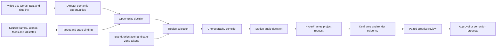

# Motion Quality Engine v1

Status: design-freeze candidate; `documented` only
Trace: RQ-002–RQ-008, RQ-012, RQ-015–RQ-016
Canonical objective SHA-256:
`402ec6d6b96d8e0b964f3b24eb0ce4231d4e9947ece28ad5650eb283810d3a12`

## 1. Purpose and boundary

The Motion Quality Engine (MQE) is a Director-owned decision compiler. It turns
approved semantic opportunities, source-state evidence, layout constraints,
brand tokens, and audio policy into typed motion contracts. It does not render
pixels, transcribe speech, alter the source EDL, or approve aesthetics.

The engine exists to answer four questions before HyperFrames is allowed to
author an effect:

1. **Why is motion useful here?**
2. **What exact meaning and source evidence is it bound to?**
3. **What visual target and source state remain valid during the effect?**
4. **What choreography and evidence will prove the render?**

If any answer is unreliable, the correct output is `caption_only`,
`reuse_source`, `quiet_source`, or `action_required`—never guessed geometry or
decorative filler.

## 2. Pipeline

Every transition emits a hash-bound machine contract. A downstream stage must
invalidate itself when an upstream contract hash changes.

## 3. Semantic opportunity model

The semantic brief records all meaningful opportunities, not just chosen
effects. Each opportunity has one decision:

- `render`: a recipe adds explanatory value.
- `annotation`: a small target-bound mark is sufficient.
- `caption_only`: speech and captions already carry the meaning.
- `reuse_source`: the source contains the best proof; avoid covering it.
- `quiet_source`: attention should stay on the speaker/source.
- `action_required`: evidence is insufficient or a creative choice is material.

The rendered Storyboard is a subset of opportunities. It must never invent
meaning, reorder source logic, or add visible text outside the approved copy
manifest.

### Semantic roles

| Role | Viewer job | Typical mechanisms | Must not become |
|---|---|---|---|
| `mark` | Notice one verified detail | underline, ring, pointer, spotlight | generic keyword card |
| `explain` | Understand a definition or mechanism | staged labels, lens, reveal, diagram | subtitle repetition |
| `relate` | See comparison, causality, or connection | split, connector, path, before/after | unbound decorative line |
| `sequence` | Follow ordered actions or phases | process rail, cursor causality, chapter progression | fixed template list |
| `prove` | Inspect evidence, metrics, or result | metric emphasis, chart focus, evidence PiP | invented number or claim |
| `resolve` | Consolidate a takeaway | compact synthesis, final state, chapter close | redundant recap card |
| `transition` | Reorient between chapters/states | mask bridge, camera move, state morph | arbitrary flourish |

`quiet_source` is an editorial role with no rendered motion and requires the
same evidence discipline as `render`.

## 4. Selection and density

Density is the consequence of explanatory opportunities, not a timer.

The selector considers:

- semantic importance and novelty;
- source visual sufficiency;
- chapter energy and recent attention load;
- reliable target availability;
- captions, face, cursor, platform UI, and existing overlays;
- recent recipe/sonic motif use;
- estimated rendering and review cost.

### Hard rules

- No fixed “one effect every N seconds” rule.
- No minimum rendered-event count or minimum family count.
- Every opportunity receives a decision, but not every decision renders.
- At most one primary explanatory event at a time. A secondary mark is allowed
  only when it shares the same semantic parent and does not create a second
  reading order.
- Consecutive similar recipes require a recorded reason.
- Quiet intervals are valid when the source already demonstrates the claim.
- Sample selection covers risk, not quotas: typical event, densest/most complex
  state, changing target, connector/IP event when present, and at least one
  evidenced quiet interval.

## 5. Stateful target binding

A source-bound recipe cannot start without a `target-binding` contract.

Each binding records:

- semantic event and source/output time windows;
- target IDs and their roles;
- normalized observed boxes at relevant timestamps;
- source-state signatures and scene/route/modal/scroll/zoom changes;
- tracking mode: `static`, `scene_bounded`, or `keyframed`;
- confidence and useful-content occupancy;
- invalidation and fallback policy.

### Tracking decisions

- `static`: only when geometry and source-state signatures remain equivalent
  through the full active window.
- `scene_bounded`: exits before a verified state boundary and may re-enter with
  a new binding.
- `keyframed`: declares observed boxes around every material change and uses a
  seek-safe interpolation/tracking plan.

If a target is lost, hidden, cropped, or materially changed, the overlay must
exit or switch binding. Extending the last known rectangle is forbidden.

### Geometry proof

For entrance, mid-hold, pre-exit, and post-exit, QA compares:

- target and overlay boxes;
- connector endpoint distance and attachment edge;
- crop, safe-zone, caption, face, cursor, and platform-UI collisions;
- useful-content occupancy and whitespace;
- actual source-state signature.

## 6. Choreography contract

Every rendered event declares four seek-safe phases:

1. `entrance`: establishes origin and reading order.
2. `explain`: reveals the semantic relationship or target.
3. `hold`: leaves the useful state readable without perpetual motion.
4. `exit`: removes or hands off before the source state becomes stale.

A recipe specifies visible poses rather than vague names. Each pose includes
time, transform/opacity/mask/filter/camera state, easing, target binding, and
layer order. The first and final states must be deterministic at arbitrary
seek times.

### Motion grammar

| Semantic role | Entrance | Explain | Hold | Exit |
|---|---|---|---|---|
| `mark` | fast local draw/scale from target | one controlled accent | static readable state | quick retract/fade |
| `explain` | staged hierarchy | progressive reveal | longest dwell | collapse toward source |
| `relate` | endpoints first | connector/path travels once | complete relation | reverse or dissolve by group |
| `sequence` | first step anchors | steps advance with speech | current + context visible | rail resolves to summary |
| `prove` | evidence surface settles | value/region receives focus | proof stays inspectable | return focus to source |
| `resolve` | calm synthesis | minimal reveal | deliberate pause | chapter transition |
| `transition` | source-aware mask/camera pickup | bridge peaks | almost no hold | lands in new state |

### Craft constraints

- Use at most two simultaneous easing families in one event.
- Overshoot belongs to a physical or expressive reason, not every card.
- Blur and glow must resolve before the reading hold.
- Camera push/pan cannot fight a moving source cursor or face.
- Parallax needs declared foreground/midground/background ownership.
- Depth, shadow, outline, and surface treatment are determined after source
  compositing, not by a fixed light-theme token.
- Text must remain live and legible unless a justified path/mask effect requires
  outlines; visible copy still remains in the manifest.
- Repeating ambient loops are forbidden during explanatory holds unless their
  amplitude is below the attention threshold and explicitly reviewed.

## 7. Recipe catalogue

These 16 recipes are mechanisms with distinct semantic and motion structures.
They are not quotas. Each has a simple fallback.

### MQE-01 — Semantic mark / tracked underline

- **Use:** one precise term, number, button, or row matters.
- **Mechanism:** target-relative underline/ring with local origin and one pulse.
- **Runtime:** SVG/DOM + GSAP.
- **Proof:** endpoint/box alignment at all phases.
- **Audio:** light tick or pencil motif only for high-value marks.
- **Fallback:** caption emphasis; never a floating keyword card.

### MQE-02 — Stateful UI focus

- **Use:** a panel/control needs temporary isolation.
- **Mechanism:** source-aware dim mask, verified focus box, label outside target.
- **Runtime:** DOM/SVG masks + GSAP.
- **Proof:** useful-content occupancy, contrast, state-window validity.
- **Audio:** short soft focus motif; silent when dialogue is dense.
- **Fallback:** cursor halo or no overlay.

### MQE-03 — Cursor/action causality

- **Use:** speech explains an interaction and its result.
- **Mechanism:** verified action target, controlled cursor path, result pulse.
- **Runtime:** GSAP MotionPath/SVG.
- **Proof:** action time, source state before/after, path endpoints.
- **Audio:** two-part action/result motif; never fake a click in source audio.
- **Fallback:** two state-bound marks.

### MQE-04 — Compare split

- **Use:** two systems, states, or metrics are contrasted.
- **Mechanism:** shared axis or split field; matched reveals; difference resolves.
- **Runtime:** DOM/GSAP; FLIP for source-linked elements.
- **Proof:** both sides map to approved evidence and remain balanced.
- **Audio:** opposing two-note motif when useful.
- **Fallback:** compact comparison labels.

### MQE-05 — Process rail

- **Use:** ordered steps or lifecycle.
- **Mechanism:** persistent rail with speech-aligned active state and completed
  history, not four unrelated cards.
- **Runtime:** SVG path + DOM/GSAP.
- **Proof:** ordering and active-step timing.
- **Audio:** restrained progression motif at major milestones only.
- **Fallback:** numbered caption treatment.

### MQE-06 — Relation graph / causal path

- **Use:** dependencies, data flow, cause/effect.
- **Mechanism:** nodes establish first; connectors attach to typed edges and
  travel once in the causal direction.
- **Runtime:** SVG MotionPath/DrawSVG-equivalent + GSAP.
- **Proof:** node targets, connector topology, attachment-edge distance.
- **Audio:** connected two/three-note motif for a completed relation.
- **Fallback:** textual `A → B` annotation outside source targets.

### MQE-07 — Metric proof / chart focus

- **Use:** a value, trend, or evidence chart supports a claim.
- **Mechanism:** chart-region focus, tracked line/point, optional count to the
  source value; no invented data.
- **Runtime:** SVG/DOM; optional path tracing.
- **Proof:** OCR/value provenance and chart target binding.
- **Audio:** subtle rise/fall motif only when it matches the claim.
- **Fallback:** source magnification.

### MQE-08 — Before/after FLIP

- **Use:** layout or object state transforms while identity persists.
- **Mechanism:** capture both verified states and use FLIP between them.
- **Runtime:** HyperFrames FLIP + GSAP.
- **Proof:** state signatures, element identity, first/final poses.
- **Audio:** short transition sweep; may be silent over source action.
- **Fallback:** matched cut with labels.

### MQE-09 — Magnified detail / product lens

- **Use:** source detail is too small to inspect.
- **Mechanism:** target-bound lens or cutout, magnified crop, contextual leader.
- **Runtime:** CSS/SVG clip-path + GSAP.
- **Proof:** crop provenance, scale, source/target mapping, whitespace.
- **Audio:** soft lens-open/close motif.
- **Fallback:** full-frame zoom or freeze.

### MQE-10 — Camera push / guided pan / freeze

- **Use:** one source region deserves temporary cinematic focus.
- **Mechanism:** source layer push/pan with protected captions/faces, optional
  freeze for inspection, then exact return.
- **Runtime:** GSAP transforms; FFmpeg may provide the freeze source asset.
- **Proof:** crop/safe-zone, return pose, no lost source action.
- **Audio:** low-energy transition bed, not a loud whoosh.
- **Fallback:** focus mask.

### MQE-11 — Masked chapter bridge

- **Use:** real chapter or source-state transition.
- **Mechanism:** source-derived mask/wipe or shape bridge carrying one chapter
  token into the next state.
- **Runtime:** SVG/CSS mask + GSAP; Lottie only for an approved brand motif.
- **Proof:** chapter boundary and landed source state.
- **Audio:** chapter motif with enough duration to read as a phrase.
- **Fallback:** clean dip/slide transition.

### MQE-12 — Kinetic phrase

- **Use:** a short approved phrase is itself the teaching object or hook.
- **Mechanism:** word grouping, typographic hierarchy, controlled stagger and
  semantic emphasis.
- **Runtime:** DOM/SVG text + GSAP.
- **Proof:** exact approved copy and word-time alignment.
- **Audio:** optional syllabic/phrase motif; not every word.
- **Fallback:** caption emphasis.

### MQE-13 — Evidence picture-in-picture

- **Use:** external/source proof must remain visible beside the main narrative.
- **Mechanism:** verified crop enters with source attribution, remains large
  enough to inspect, and exits before relevance ends.
- **Runtime:** DOM/video/canvas + GSAP.
- **Proof:** evidence hash, crop, attribution, legibility.
- **Audio:** usually silent; source audio policy is explicit.
- **Fallback:** full-screen evidence cutaway.

### MQE-14 — Componentized IP / concept vignette

- **Use:** self-owned content benefits from a topic-specific metaphor not
  already visible in the source.
- **Mechanism:** transparent, padded components enter separately and interact
  with a verified concept—not a full-screen white card.
- **Runtime:** DOM/SVG/Lottie + GSAP.
- **Proof:** identity permission, anatomy/text/semantic review, component bounds.
- **Audio:** coherent character/object motif.
- **Fallback:** neutral concept diagram; forbidden in `third_party` mode.

### MQE-15 — Architecture / map layers

- **Use:** multiple tiers, systems, or locations must be understood together.
- **Mechanism:** staged layers, depth ordering, paths, and one guided traversal.
- **Runtime:** SVG/DOM/GSAP; optional camera transform.
- **Proof:** topology, labels, connectors, visible hierarchy.
- **Audio:** restrained layer-build motif.
- **Fallback:** 2D process/relationship graph.

### MQE-16 — Depth stage / 3D object explanation

- **Use:** depth, rotation, spatial assembly, or a real 3D product is essential.
- **Mechanism:** Three/WebGL/TypeGPU stage with a DOM/SVG text layer.
- **Runtime:** advanced HyperFrames runtime; feature flag default off.
- **Proof:** fallback render, device/browser parity, cost receipt, seek safety.
- **Audio:** designed sequence only when justified.
- **Fallback:** layered 2.5D composition.

## 8. Orientation and source-type adaptation

### Landscape screen recording

- Prefer target-relative marks, lenses, guided pans, and evidence PiP.
- Preserve small UI text; do not cover the action area with large cards.
- Side placement is allowed only after measuring available whitespace.

### Portrait talking head

- Face and hand zones are protected and tracked.
- Prefer side rails, lower-third annotations above captions, brief cutaways, and
  shallow camera emphasis.
- Full-screen explanatory graphics require an intentional cutaway and a clean
  return; they cannot silently cover the speaker.

### Mixed/rotated source

- Display orientation comes from rotation-aware probe data.
- Each state gets its own layout decision; one coordinate table cannot span a
  rotation or aspect-ratio change.

## 9. Composite readability

Readability is measured against the composited source at representative times.
The engine selects one of:

- opaque or translucent adaptive surface;
- local blur/dim behind overlay;
- outline/keyline and controlled shadow;
- target-relative placement in verified whitespace;
- brief source freeze/zoom;
- recipe fallback or no render.

Internal token contrast alone is not sufficient. A light cyan box on a light
dashboard must fail even if the text-to-box contrast passes.

## 10. Motion audio grammar

Every render event has one `motion-audio-decision`:

- `cue`: one or more phases use a measured sonic motif.
- `intentionally_silent`: silence protects dialogue or source audio.

100% means decision coverage, not audible cue coverage. The initial audible
corridor is 35–65% and adapts by chapter energy and masking risk. A family is a
perceptual motif, not a filename. Diversity uses onset, duration, pitch contour,
spectral envelope, and family identity; three to five coherent motifs are
preferred over forced uniqueness.

Dialogue-relative audibility is measured in short windows around the cue.
Master loudness and true peak remain final mix gates. If a cue cannot be heard
without harming intelligibility, the event becomes intentionally silent.

## 11. HyperFrames capability map

| Need | Preferred HyperFrames mechanism | Required proof |
|---|---|---|
| seek-safe staged motion | GSAP timeline attached to project frame/time | strict check, animation map, first/final state |
| state-preserving transform | FLIP | before/after target identity and keyframe shots |
| connectors and travel | SVG/path/motion path | typed endpoints, midpoint, full attachment |
| focus and reveal | SVG/CSS mask, clip-path, filters | composite snapshots and crop check |
| text hierarchy | live DOM/SVG text | visible-copy manifest and snapshot text inspection |
| branded complex vector | Lottie | licensed asset, deterministic frame proof |
| spatial depth | Three/WebGL/TypeGPU | runtime/fallback/parity/cost evidence |
| keyframe diagnosis | `hyperframes-keyframes` focused shots/ghosts/snapshots | `keyframe-receipt` |
| final project safety | `hyperframes check --strict` and render parity | bound reports and exact project hash |

The Director integrates these capabilities through project requests and
receipts. It does not copy upstream skill source or assume undocumented APIs.

## 12. Review and promotion

### Automated blockers

- semantic/event/copy/word/time/hash mismatch;
- missing target or stale state window;
- geometry, connector, crop, safe-zone, face, caption, or platform collision;
- unseekable or missing keyframe phase;
- composite contrast failure;
- audio decode/onset/masking/true-peak failure;
- baseline/candidate/evidence hash drift.

### Multimodal reject/recommend only

- motion does not explain the approved takeaway;
- metaphor is weak or misleading;
- choreography feels mechanical, cluttered, or visually inconsistent;
- anatomy, generated text, or source-target relation appears wrong.

### User-only approval

- candidate is better than the baseline and worth publishing;
- brand taste and creative tone;
- real-person likeness and cover click appeal;
- final correction cost is acceptable.

A fixture can promote a contract to `fixture_validated`; only the two current
real canaries and explicit human evidence can promote the implementation to
`real_project_validated`. Production default requires a separate promotion
decision.

## 13. Prohibited strategies

- fixed cadence or forced event/family quotas;
- random keywords, subtitle restatement, or visible copy outside the approved
  manifest;
- boxes, arrows, or connectors without verified targets and active windows;
- keeping an overlay after scroll/modal/route/layout state invalidation;
- random template rotation, random easing, or random sound assignment;
- forcing SFX on every event or treating unique filenames as sonic diversity;
- copying proprietary CapCut/Jianying effects or claiming visual equivalence;
- using personal identity/IP in third-party mode;
- allowing tests or a multimodal score to approve aesthetics, likeness, or
  publishability.

## 14. Examples

**Positive:** A report-demo event binds the phrase “CTR rises while CPC falls”,
two chart targets, and their active modal state. MQE-04 reveals both targets,
draws one controlled difference cue, holds while the comparison is spoken, and
exits before scroll. Keyframe, geometry, contrast, and audio receipts all bind
to the same event.

**Negative:** A card reading “打开” appears because keyword scoring crossed a
threshold. It has no approved visible copy, target, or viewer takeaway. The
compiler rejects it before HyperFrames.

**Boundary:** A 40-second UI interaction contains frequent state changes but the
source cursor already explains them. The selector emits several `reuse_source`
decisions and one stateful focus event. Sparse rendered motion is correct because
decision coverage and explanatory value—not density—are the acceptance target.
