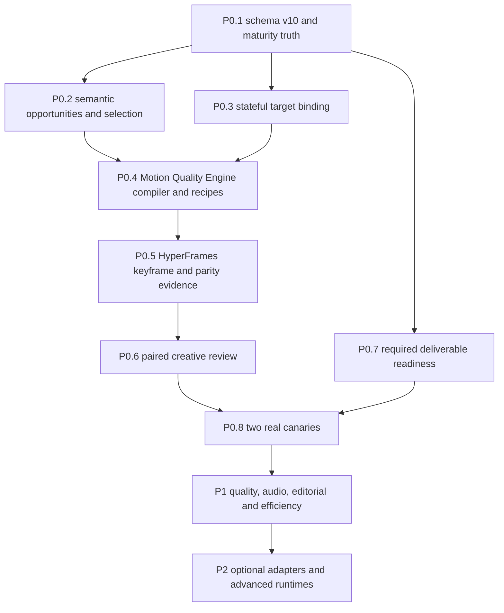

# P0-P2 Implementation Plan

Status: design-freeze candidate; implementation is not authorized in this phase.
Scope: all RQ-001–RQ-020.

## 1. Dependency order

P1 cannot start until the P0 contracts, negative tests, paired sample review,
and both real canaries pass. P2 cannot change the default one-click path and is
feature-flagged off until separately promoted.

## 2. Global implementation rules

- Every work item and test cites one or more RQ IDs.
- Tests are written red first. A fixture promotes only to `fixture_validated`.
- Existing project YAML is never silently rewritten; migration returns a copy.
- Required external/user work becomes `action_required`, not `complete`.
- Generated assets are content-addressed; invalidation flows downstream by hash.
- Upstream video-use/HyperFrames/Remotion/NLE source is not modified without an
  independent minimal reproduction proving upstream ownership.
- Full video render is forbidden until the short sample and all P0 gates pass.
- User corrections are proposals, then correction-ledger entries; no untracked
  mutation of generated files.

## 3. P0 — Correctness and real quality proof

### P0.1 — Schema v10, maturity, and readiness truth

**Trace:** RQ-009, RQ-013, RQ-015, RQ-018, RQ-020.

**Tests first**

- Add v1–v9 migration fixtures proving additive in-memory migration.
- Prove `project.yaml` bytes remain unchanged.
- Prove `contract_ready` cannot satisfy a required delivery stage.
- Prove stage and approval invalidation on upstream hash change.
- Prove capability maturity cannot jump from fixture to production default.

**Planned source targets**

- Modify `scripts/project_config.py`, `scripts/director.py`,
  `scripts/completion_audit.py`, and capability-registry validation.
- Modify `references/config-schema.md`, `references/director-architecture.md`,
  `references/quality-gates.md`, and `SKILL.md` only after runtime behavior exists.
- Add/extend `tests/test_project_config_migration.py`, `tests/test_director.py`,
  and `tests/test_completion_audit.py`.

**Configuration draft**

- `schema_version: 10`
- `motion_quality.enabled: false` for migrated projects until canary promotion.
- `identity.mode: self|third_party|generic`, required after migration defaults
  are inferred conservatively (`generic` when identity is unknown).
- `delivery.required_assets` records applicability and required readiness.

**Exit:** legacy tests pass; new readiness and migration negative tests pass.

### P0.2 — Semantic opportunities, selection, and visible-copy authority

**Trace:** RQ-002, RQ-005, RQ-019–RQ-020.

**Tests first**

- Remove exact brief-event/Storyboard-event count equality.
- Reject a render event without a semantic parent or approved copy.
- Reject arbitrary/nested visible strings not present in renderer-exported text.
- Accept fewer than four render events when opportunities justify quiet/source.
- Require a decision for every semantic opportunity and preserve ordering.
- Prove random/repeated low-information anchors and subtitle restatement fail.

**Planned source targets**

- Modify `scripts/director_contracts.py`, semantic request construction in
  `scripts/director.py`, `scripts/visual_dynamics_qa.py`, and Storyboard request
  serialization.
- Add `scripts/motion_opportunity_selector.py` only if the logic cannot remain a
  small cohesive module in `director_contracts.py`.
- Extend `tests/test_director_contracts.py`, `tests/test_director.py`, and add
  `tests/test_motion_opportunity_selector.py` if the new module exists.

**Exit:** all opportunities are accounted for, but rendering is never forced.

### P0.3 — Stateful target binding and adaptive layout

**Trace:** RQ-003–RQ-004, RQ-007, RQ-012–RQ-013.

**Tests first**

- Static target passes only under equivalent state signatures.
- Modal close, scroll, route, layout, visibility, rotation, and target-loss cases
  fail stale overlays.
- Keyframed binding covers each material state change.
- Connector endpoints and attachment edges meet tolerance at all phases.
- Landscape UI and portrait face/hand/caption protection fixtures differ.
- Third-party identity mode rejects HongRun assets/copy.

**Planned source targets**

- Add `scripts/target_binding.py` and
  `scripts/target_binding_qa.py` using the target-binding schema.
- Integrate with `scripts/evidence_acquisition.py`,
  `scripts/select_motion_safe_zones.py`, `scripts/director_contracts.py`, and
  `scripts/director.py`.
- Extend `tests/test_evidence_acquisition.py`, `tests/test_adaptive_motion.py`,
  and add target-binding tests with real-frame-sized fixtures.

**Optional detectors:** scene detection, OCR, face/hand tracking may produce
evidence through adapters. Their absence must yield a safe fallback, not a
guessed target.

**Exit:** every source-bound event has a valid active state window or does not
render.

### P0.4 — Motion Quality Engine compiler and recipe registry

**Trace:** RQ-002, RQ-005–RQ-007, RQ-012.

**Tests first**

- Validate all seven contract schemas and cross-contract invariants.
- Compile identical inputs deterministically.
- Reject unmet preconditions, forbidden identity, unsafe layout, and unavailable
  advanced runtimes; select declared fallback.
- Prove different semantic roles produce different choreography fingerprints.
- Prove no fixed cadence, quota, random family, keyword, or SFX selection.
- Validate all 16 recipes plus positive, negative, and boundary fixtures.

**Planned source targets**

- Add `scripts/motion_quality_engine.py`, `scripts/motion_contracts.py`, and a
  versioned `references/motion-recipes-v1.json` (or one JSON file per recipe if
  review size requires it).
- Replace production use of `scripts/build_dynamic_hyperframes.py` as a creative
  selector; retain it only as a legacy adapter while migration is active.
- Integrate through `scripts/hyperframes_router.py` and Director requests.
- Add `tests/test_motion_quality_engine.py`,
  `tests/test_motion_contracts.py`, and recipe-specific fixtures.

**Exit:** HyperFrames receives typed choreography, not a free-form request to
invent meaning or geometry.

### P0.5 — HyperFrames keyframe, visible-text, geometry, and parity proof

**Trace:** RQ-003–RQ-007, RQ-015, RQ-020.

**Tests first**

- Require strict check, animation map, and four phase observations.
- Reject midpoint-only proof, clipped or post-exit remnants, stale source state,
  missing connectors, and caption collision.
- Require actual renderer-exported visible-text/DOM manifest to equal approved
  copy; metadata alone is insufficient.
- Require Studio/final parity within per-property tolerances.
- Prove all receipts bind exact project/contract/source hashes.

**Planned source targets**

- Add `scripts/keyframe_receipt.py` and a HyperFrames project-side text/geometry
  export contract without modifying upstream source.
- Extend `scripts/build_motion_snapshot_plan.py`,
  `scripts/preview_render_parity.py`, `scripts/visual_dynamics_qa.py`,
  `scripts/aesthetic_qa.py`, and `scripts/director.py`.
- Add `hyperframes-keyframes` to advanced-project request instructions.
- Extend `tests/test_motion_snapshot_plan.py`,
  `tests/test_preview_render_parity.py`, `tests/test_adaptive_motion.py`, and
  `tests/test_aesthetic_qa.py`.

**Exit:** painted pixels and DOM/geometry export—not request metadata—prove the
event.

### P0.6 — Paired creative review and correction proposals

**Trace:** RQ-002–RQ-008, RQ-015–RQ-016, RQ-020.

**Tests first**

- Review embeds baseline/candidate, same event/times, four phases, rationale,
  target overlay, and SFX/BGM auditions.
- Default is pending; automated or multimodal actors cannot approve user fields.
- Hash drift marks review stale and invalidates sample approval.
- UI produces pending correction proposals only; ledger approval/replay remains
  auditable.
- Loopback server, CSRF, path containment, and stored-XSS cases fail closed.

**Planned source targets**

- Evolve `scripts/review_dashboard.py` and `scripts/review_server.py`; reuse
  `scripts/manual_finish.py` correction-ledger semantics.
- Extend `tests/test_review_dashboard.py`, `tests/test_review_server.py`, and
  manual-finish/correction-ledger tests.

**Exit:** a user can identify an event-level problem without manually describing
the whole frame, and approval remains human-authored.

### P0.7 — Required deliverable closure

**Trace:** RQ-001, RQ-009–RQ-011, RQ-013–RQ-015.

**Tests first**

- Required caption, cover, audio, or identity output cannot finish as contract
  only.
- Master captions remain word/EDL-bound and applied last.
- One universal MP4 supplies all platform reports by the same hash.
- Missing optional BGM is truthful `disabled/unavailable`; missing required
  captions block delivery.
- Final output fully decodes and passes final-edit-correctness.

**Planned source targets**

- Modify final stage readiness in `scripts/director.py`, final composition
  contract, caption bridge, audio/cover adapters, and completion audit.
- Extend `tests/test_director.py`, `tests/test_completion_audit.py`,
  `tests/test_word_aligned_captions.py`, audio/cover tests, and delivery tests.

**Exit:** “complete” means exact assets exist and pass their applicable gates.

### P0.8 — Real canaries and promotion decision

**Trace:** all P0 requirements and RQ-020.

1. Run a 30–90s authorized landscape screen/product demo.
2. Run a separate 30–90s authorized portrait talking-head clip.
3. Preserve baseline and candidate with exact hashes.
4. Run automated gates, multimodal reject/recommend review, then user paired
   review.
5. Record semantic/geometry correctness, caption sync, audio audibility,
   correction minutes, preference, publish willingness, wall time, and cost.
6. Promote only if both canaries pass under the same implementation commit and
   configuration family.

**Exit:** two `real-project-validation` receipts; no fixture substitution.

## 4. P1 — Quality, commercial coherence, and efficient iteration

P1 starts only after P0.8 passes.

### P1.1 — Perceptual motion-audio system

**Trace:** RQ-008, RQ-018, RQ-020.

- Replace asset-path uniqueness with family + onset + duration + pitch/spectral
  fingerprint.
- Measure short-window dialogue/cue relationship and onset error from the real
  mixed media.
- Enforce 100% decision coverage and adaptive audible corridor; never cue every
  event merely to pass a percentage.
- Build 3–5 coherent motif families with licensing/provenance receipts.
- Extend `scripts/audio_qa.py`, `scripts/audio_production.py`, audio tests, and
  `references/sfx-palette.json` only when executable checks exist.

### P1.2 — Caption segmentation and sync closure

**Trace:** RQ-010.

- Segment from word timings and punctuation semantics, remove display punctuation
  by policy only after sentence boundaries are fixed.
- Validate first/middle/last, cut-boundary, terminology, and final composite.
- Keep karaoke optional and off by default for this workflow.

### P1.3 — Editorial intent and promise ledger

**Trace:** RQ-014, RQ-019–RQ-020.

- Add audience, viewer job, single promise, proof, CTA, tone, and prohibited
  claims to the semantic request and schema.
- Bind hook, title, cover, description, and visible motion copy to the same
  evidence-backed promise without mechanical repetition.
- Unknown intent defaults to neutral education; it cannot invent a sales goal.

### P1.4 — Regression, cache, cost, and preference learning

**Trace:** RQ-015–RQ-018.

- Establish Current Golden only after sample approval, using normalized DOM,
  layout, motion fingerprints, and representative perceptual/geometry evidence.
- Cache by source/config/contract/runtime hashes; changes invalidate only affected
  events and downstream receipts.
- Record provider reservations, actual costs, retries, render time, and cache
  savings.
- Learn from approved correction-ledger entries; do not silently mutate brand
  defaults from unapproved edits.

## 5. P2 — Optional extensions, default off

P2 starts only after P1 regressions remain stable. Each capability has an
independent feature flag, availability check, loss report, and rollback.

### P2.1 — OTIO and NLE handoff adapters

**Trace:** RQ-017–RQ-018, RQ-020.

- Export typed, hash-bound timeline/interchange packages where the target can
  represent them.
- Record unsupported effects and round-trip loss.
- Human work remains `action_required`; returned media invalidates and reruns all
  delivery gates.
- Do not claim OpenCut/OpenChatCut/Jianying APIs that are not verified.

### P2.2 — Selected Remotion events

**Trace:** RQ-006, RQ-017–RQ-018.

- Enable only for named events with an existing maintained React component and
  parity proof.
- HyperFrames remains full-composition owner.

### P2.3 — Advanced HyperFrames runtimes

**Trace:** RQ-006–RQ-007, RQ-018.

- Enable Lottie/Three/WebGL/TypeGPU only per recipe and device/cost evidence.
- Require deterministic 2D fallback, seek safety, and preview/render parity.

### P2.4 — Optional perception/generative adapters

**Trace:** RQ-003–RQ-004, RQ-014, RQ-018–RQ-020.

- Scene, OCR, face/hand, IP-image, cover, or music providers supply evidence or
  assets through contracts.
- Cloud upload requires configured provider, rights, privacy, cost, and
  provenance approval.
- Generated anatomy, text, likeness, and topic fit remain separately reviewed.

## 6. Cache invalidation matrix

| Changed input | Minimum invalidation |
|---|---|
| source media / EDL / word timeline | all semantic, motion, captions, audio, render, delivery |
| semantic brief / editorial intent | motion design, Storyboards, audio decisions, reviews, renders |
| target binding | affected events, keyframe/parity, sample/full approvals, renders |
| recipe/version/runtime | affected events, keyframes, review, renders |
| brand/layout tokens | affected visual events, contrast, cover when shared |
| SFX/BGM asset or mix policy | audio QA, final compose, delivery QA |
| master captions | sample/final compose, caption QA, delivery QA |
| manual correction | affected contract/event plus all downstream artifacts |
| renderer/browser version | parity, keyframes, affected renders, Golden comparison |

Event-scoped invalidation is allowed only when the dependency graph proves no
shared artifact changed. Otherwise fail closed and invalidate the larger scope.

## 7. Rollback strategy

- Project schema migration is in memory; rollback selects the prior code and
  original YAML bytes.
- MQE remains feature-flagged for migrated projects until real canaries pass.
- Legacy dynamic-motion requests may remain readable but cannot claim new MQE
  maturity.
- Each P1/P2 feature has a default-off switch and produces no artifact when off.
- If a new event fails, fall back to its declared simpler recipe, caption/source,
  or `action_required`; never silently substitute a static generic card.
- Approval receipts are immutable. Rollback creates new artifacts and review;
  it does not rewrite history.

## 8. Verification cost bands

| Band | Work | Expected validation cost |
|---|---|---|
| V0 | schema/docs/fixtures | seconds to a few minutes; no media render |
| V1 | unit/integration plus synthetic short media | minutes; local CPU |
| V2 | one 30–90s canary sample | tens of minutes depending on HyperFrames and STT cache |
| V3 | paired two-canary validation | approximately two sample renders plus human review |
| V4 | full-video production validation | only after V3; source-duration dependent |

No implementation item is “done” merely because its lower-cost test band passes.

## 9. Implementation completion definition

The later implementation Goal is complete only when:

1. all P0/P1/P2-in-scope tests pass;
2. legacy configuration and default-off behavior pass;
3. exact full-suite acceptance receipt is current;
4. the two real canaries pass and remain hash-bound to the same implementation;
5. user approvals exist for paired sample quality and publishability;
6. docs describe implemented maturity truthfully;
7. only then may verified code be committed and pushed under the project Git
   delivery rules.
